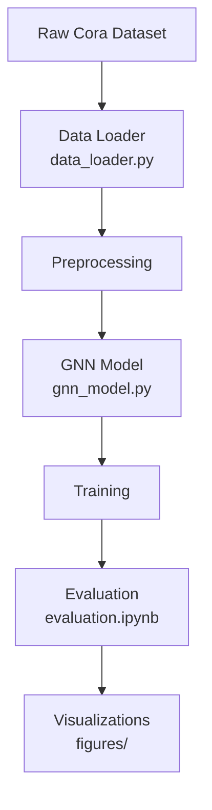
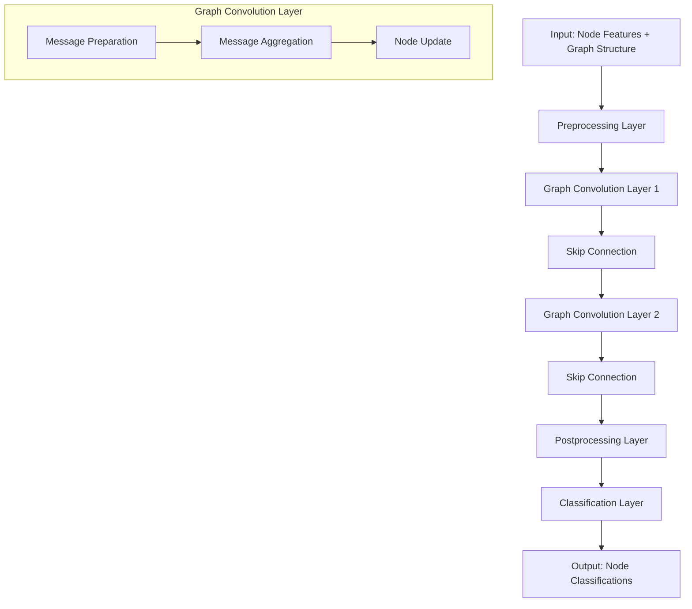
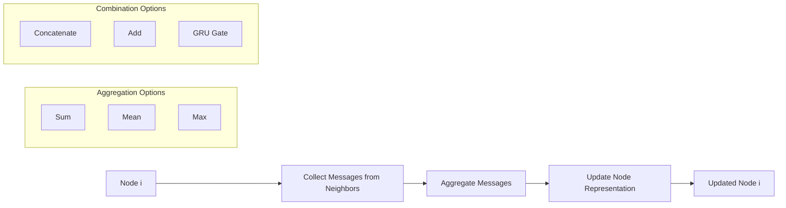
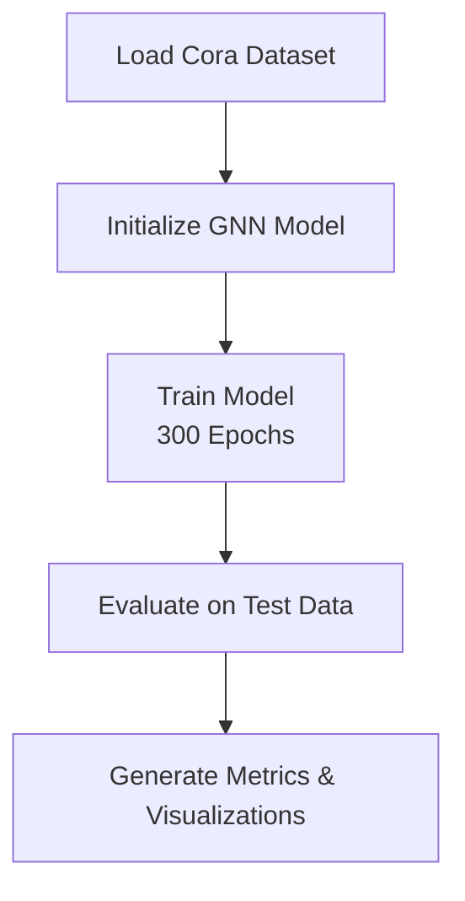

# 🧠 GraphLearn: Graph Neural Network for Node Classification

[](https://www.python.org/)
[](https://tensorflow.org/)
[](https://networkx.org/)
[](LICENSE)

A comprehensive implementation of **Graph Neural Networks (GNNs)** for **node classification** using the **Cora citation network dataset**. This project showcases the power of graph-based deep learning to model relationships in networked data.

---

## 🎯 Overview

This repository implements a **Graph Neural Network (GNN)** to classify academic papers based on their **content features** and **citation relationships**. By leveraging the graph structure, the model propagates information between connected nodes, outperforming traditional neural networks.

**Data Pipeline**:


---

## 🔥 Key Features

- 🧩 **Custom Graph Convolutional Layer**: Implements message passing with multiple aggregation strategies.
- 🏗️ **Flexible Architecture**: Supports combination methods (concat, add, GRU).
- 📊 **Baseline Comparison**: Includes a feedforward neural network for benchmarking.
- 🌐 **Graph Augmentation**: Adds new nodes and edges for inference.
- 📈 **Comprehensive Evaluation**: Detailed metrics and visualizations.

---

## 📊 Dataset: Cora Citation Network

The **Cora dataset** is a benchmark for GNNs:

| **Metric** | **Value** |
|------------|-----------|
| **Papers** | 2,708 |
| **Citations** | 5,429 |
| **Features** | 1,433 (binary word features) |
| **Classes** | 7 research subjects |
| **Task** | Node classification |

### Research Subjects
- Case_Based
- Genetic_Algorithms
- Neural_Networks
- Probabilistic_Methods
- Reinforcement_Learning
- Rule_Learning
- Theory

---

## 🏗️ Architecture

### Graph Neural Network Flow


### Message Passing Mechanism


---

## 🚀 Quick Start

### Prerequisites
```bash
pip install tensorflow pandas numpy networkx matplotlib
```

### Installation
1. Clone the repository:
   ```bash
   git clone https://github.com/yourusername/GraphLearn.git
   cd GraphLearn
   ```
2. Install dependencies:
   ```bash
   pip install -r requirements.txt
   ```

### Basic Usage
```python
import tensorflow as tf
from src.gnn_model import GNNNodeClassifier
from src.data_loader import load_cora_data

# Load the Cora dataset
graph_info, train_data, test_data = load_cora_data()

# Create GNN model
model = GNNNodeClassifier(
    graph_info=graph_info,
    num_classes=7,
    hidden_units=[32, 32],
    dropout_rate=0.5
)

# Train the model
history = model.fit(train_data, epochs=300)

# Evaluate performance
test_accuracy = model.evaluate(test_data)
print(f"Test Accuracy: {test_accuracy:.2%}")
```

**Training Flowchart**:


---

## 📁 Project Structure

```
GraphLearn/
├── src/
│   ├── data_loader.py          # Data loading and preprocessing
│   ├── graph_conv_layer.py     # Custom graph convolution layer
│   ├── gnn_model.py            # Main GNN model implementation
│   ├── baseline_model.py       # Feedforward baseline model
│   └── utils.py                # Utility functions
├── notebooks/
│   ├── exploration.ipynb       # Data exploration
│   ├── training.ipynb         # Model training
│   └── evaluation.ipynb       # Results analysis
├── experiments/
│   ├── hyperparameter_tuning.py
│   └── ablation_studies.py
├── results/
│   ├── figures/
│   └── logs/
├── requirements.txt
├── README.markdown
└── main.py                     # Main training script
```

---

## 🔧 Model Architecture Details

### Graph Convolutional Layer
The core component implements the message passing framework:
1. **Message Preparation**: Transform neighbor features.
   ```python
   messages = ffn_prepare(neighbor_features)
   ```
2. **Message Aggregation**: Combine messages from all neighbors.
   ```python
   aggregated = aggregate_function(messages)  # sum, mean, or max
   ```
3. **Node Update**: Update node representations.
   ```python
   updated_node = update_function(node_features, aggregated_messages)
   ```

### Hyperparameters
| **Parameter** | **Value** | **Description** |
|---------------|-----------|-----------------|
| `hidden_units` | [32, 32] | Hidden layer dimensions |
| `learning_rate` | 0.01 | Adam optimizer learning rate |
| `dropout_rate` | 0.5 | Dropout for regularization |
| `batch_size` | 256 | Training batch size |
| `epochs` | 300 | Maximum training epochs |

---

## 📈 Performance Results

### Model Comparison
```chartjs
{
  "type": "bar",
  "data": {
    "labels": ["Baseline FFN", "Graph Neural Network"],
    "datasets": [{
      "label": "Test Accuracy (%)",
      "data": [75, 85],
      "backgroundColor": ["#36A2EB", "#FF6384"],
      "borderColor": ["#36A2EB", "#FF6384"],
      "borderWidth": 1
    }]
  },
  "options": {
    "scales": {
      "y": {
        "beginAtZero": true,
        "max": 100,
        "title": {
          "display": true,
          "text": "Test Accuracy (%)"
        }
      },
      "x": {
        "title": {
          "display": true,
          "text": "Model"
        }
      }
    },
    "plugins": {
      "legend": {
        "display": false
      },
      "title": {
        "display": true,
        "text": "Model Performance Comparison"
      }
    }
  }
}
```

### Key Insights
- **Graph Structure Matters**: GNNs outperform the baseline by leveraging citation relationships.
- **Message Passing**: Neighboring papers provide valuable context for classification.
- **Regularization**: Dropout and early stopping prevent overfitting on the small dataset.

---

## 🧪 Experiments

### Ablation Studies
Explore component contributions:
- **Aggregation Methods**: Compare sum, mean, and max aggregation.
- **Combination Strategies**: Analyze concat, add, and GRU combinations.
- **Layer Depth**: Test effects of different numbers of graph conv layers.
- **Regularization**: Evaluate impact of dropout and normalization.

### Hyperparameter Tuning
Systematic exploration of:
- **Learning Rates**: [0.001, 0.01, 0.1]
- **Hidden Dimensions**: [16, 32, 64, 128]
- **Dropout Rates**: [0.1, 0.3, 0.5, 0.7]

---

## 🔮 Advanced Features

### Dynamic Graph Augmentation
Add new nodes and edges during inference:
```python
# Add new papers to the graph
new_papers = generate_synthetic_papers(num_papers=7)
augmented_graph = add_nodes_to_graph(graph, new_papers)

# Predict classifications for new papers
predictions = model.predict(augmented_graph)
```

### Visualization
Generate insightful visualizations:
- Graph structure with node colors representing classes.
- Learning curves showing training progress.
- Confusion matrices for classification performance.
- t-SNE plots of learned node embeddings.

---

## 🤝 Contributing

We welcome contributions! See our [Contributing Guidelines](CONTRIBUTING.md) for details.

### Development Setup
```bash
# Clone repository
git clone https://github.com/yourusername/GraphLearn.git
cd GraphLearn

# Create virtual environment
python -m venv venv
source venv/bin/activate  # On Windows: venv/Scripts/activate

# Install dependencies
pip install -r requirements.txt
pip install -r requirements-dev.txt

# Run tests
pytest tests/
```

---

## 📚 References

1. **Kipf, T. N., & Welling, M. (2016)**. Semi-supervised classification with graph convolutional networks. *arXiv preprint arXiv:1609.02907*.
2. **Hamilton, W. L. (2020)**. Graph representation learning. *Synthesis Lectures on Artificial Intelligence and Machine Learning*.
3. **Wu, Z., Pan, S., Chen, F., Long, G., Zhang, C., & Philip, S. Y. (2020)**. A comprehensive survey on graph neural networks. *IEEE Transactions on Neural Networks and Learning Systems*.

---

## 📄 License

This project is licensed under the **MIT License**—see the [LICENSE](LICENSE) file for details.

---

## 🙏 Acknowledgments

- **Cora Dataset**: University of California, Santa Cruz.
- **TensorFlow Team**: For the excellent deep learning framework.
- **NetworkX Community**: For graph processing tools.

---

## 📞 Contact

- **Author**: Your Name
- **Email**: your.email@example.com
- **GitHub**: [@yourusername](https://github.com/yourusername)
- **LinkedIn**: [Your LinkedIn](https://linkedin.com/in/yourprofile)

---

<div align="center">

**⭐ If you find this project useful, please consider giving it a star! ⭐**

*Built with ❤️ for graph learning enthusiasts*

</div>
