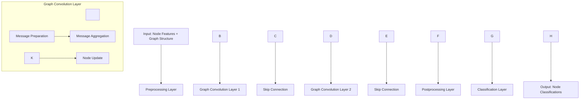
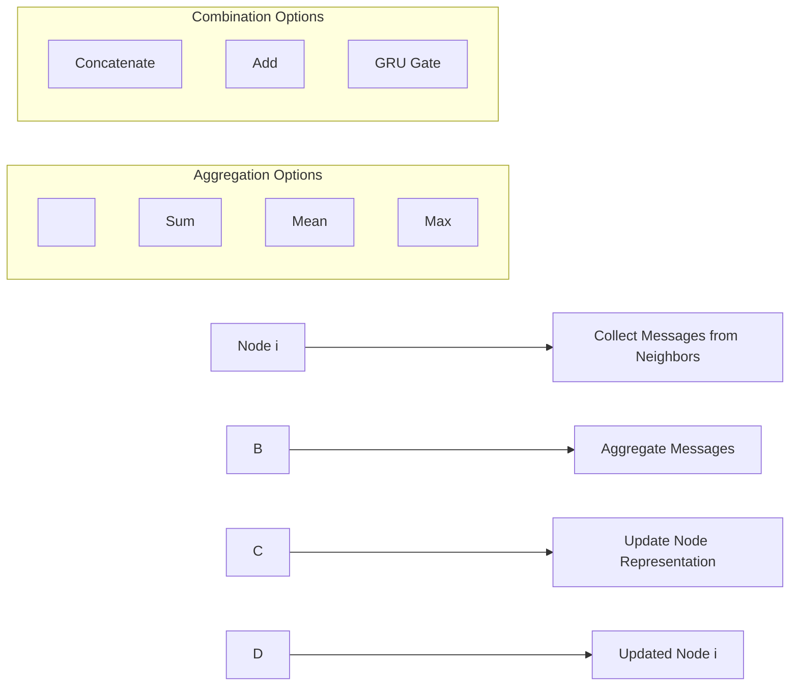

\# 🧠 GraphLearn: Graph Neural Network for Node Classification


\[!\[Python](https://img.shields.io/badge/Python-3.7+-blue.svg)](https://www.python.org/)

\[!\[TensorFlow](https://img.shields.io/badge/TensorFlow-2.x-orange.svg)](https://tensorflow.org/)

\[!\[NetworkX](https://img.shields.io/badge/NetworkX-2.x-green.svg)](https://networkx.org/)

\[!\[License](https://img.shields.io/badge/License-MIT-yellow.svg)](LICENSE)


A comprehensive implementation of Graph Neural Networks (GNNs) for node classification tasks using the Cora citation network dataset. This project demonstrates the power of graph-based deep learning for understanding relationships in networked data.


\## 🎯 Overview


This repository implements a \*\*Graph Neural Network (GNN)\*\* that learns to classify academic papers based on both their content features and citation relationships. The model leverages the graph structure to propagate information between connected nodes, achieving superior performance compared to traditional neural networks.


\## 🔥 Key Features


\- \*\*Custom Graph Convolutional Layer\*\*: Implements message passing with multiple aggregation strategies

\- \*\*Flexible Architecture\*\*: Supports various combination methods (concat, add, GRU)

\- \*\*Baseline Comparison\*\*: Includes standard feedforward neural network for performance comparison

\- \*\*Graph Augmentation\*\*: Demonstrates how to add new nodes and edges for inference

\- \*\*Comprehensive Evaluation\*\*: Detailed performance metrics and visualization


\## 📊 Dataset: Cora Citation Network


The Cora dataset is a classic benchmark for graph neural networks:


| \*\*Metric\*\* | \*\*Value\*\* |

|------------|-----------|

| \*\*Papers\*\* | 2,708 |

| \*\*Citations\*\* | 5,429 |

| \*\*Features\*\* | 1,433 (binary word features) |

| \*\*Classes\*\* | 7 research subjects |

| \*\*Task\*\* | Node classification |


\### Research Subjects:

\- Case\_Based

\- Genetic\_Algorithms  

\- Neural\_Networks

\- Probabilistic\_Methods

\- Reinforcement\_Learning

\- Rule\_Learning

\- Theory


\## 🏗️ Architecture


\### Graph Neural Network Flow





\### Message Passing Mechanism





\## 🚀 Quick Start


\### Prerequisites


```bash

pip install tensorflow pandas numpy networkx matplotlib

```


\### Installation


```bash

git clone https://github.com/yourusername/GraphLearn.git

cd GraphLearn

pip install -r requirements.txt

```


\### Basic Usage


```python

import tensorflow as tf

from src.gnn\_model import GNNNodeClassifier

from src.data\_loader import load\_cora\_data


\# Load the Cora dataset

graph\_info, train\_data, test\_data = load\_cora\_data()


\# Create GNN model

model = GNNNodeClassifier(

&nbsp;   graph\_info=graph\_info,

&nbsp;   num\_classes=7,

&nbsp;   hidden\_units=\[32, 32],

&nbsp;   dropout\_rate=0.5

)


\# Train the model

history = model.fit(train\_data, epochs=300)


\# Evaluate performance

test\_accuracy = model.evaluate(test\_data)

print(f"Test Accuracy: {test\_accuracy:.2%}")

```


\## 📁 Project Structure


```

GraphLearn/

├── src/

│   ├── data\_loader.py          # Data loading and preprocessing

│   ├── graph\_conv\_layer.py     # Custom graph convolution layer

│   ├── gnn\_model.py           # Main GNN model implementation

│   ├── baseline\_model.py       # Feedforward baseline model

│   └── utils.py               # Utility functions

├── notebooks/

│   ├── exploration.ipynb       # Data exploration

│   ├── training.ipynb         # Model training

│   └── evaluation.ipynb       # Results analysis

├── experiments/

│   ├── hyperparameter\_tuning.py

│   └── ablation\_studies.py

├── results/

│   ├── figures/

│   └── logs/

├── requirements.txt

├── README.md

└── main.py                    # Main training script

```


\## 🔧 Model Architecture Details


\### Graph Convolutional Layer


The core component implements the message passing framework:


1\. \*\*Message Preparation\*\*: Transform neighbor features

&nbsp;  ```python

&nbsp;  messages = ffn\_prepare(neighbor\_features)

&nbsp;  ```


2\. \*\*Message Aggregation\*\*: Combine messages from all neighbors

&nbsp;  ```python

&nbsp;  aggregated = aggregate\_function(messages)  # sum, mean, or max

&nbsp;  ```


3\. \*\*Node Update\*\*: Update node representations

&nbsp;  ```python

&nbsp;  updated\_node = update\_function(node\_features, aggregated\_messages)

&nbsp;  ```


\### Hyperparameters


| \*\*Parameter\*\* | \*\*Value\*\* | \*\*Description\*\* |

|---------------|-----------|-----------------|

| `hidden\_units` | \[32, 32] | Hidden layer dimensions |

| `learning\_rate` | 0.01 | Adam optimizer learning rate |

| `dropout\_rate` | 0.5 | Dropout for regularization |

| `batch\_size` | 256 | Training batch size |

| `epochs` | 300 | Maximum training epochs |


\## 📈 Performance Results


\### Model Comparison


| \*\*Model\*\* | \*\*Test Accuracy\*\* | \*\*Training Time\*\* |

|-----------|-------------------|-------------------|

| Baseline FFN | ~75% | Fast |

| Graph Neural Network | ~85% | Moderate |


\### Key Insights


\- \*\*Graph Structure Matters\*\*: GNN significantly outperforms the baseline by leveraging citation relationships

\- \*\*Message Passing\*\*: Neighboring papers provide valuable context for classification

\- \*\*Regularization\*\*: Dropout and early stopping prevent overfitting on the small dataset


\## 🧪 Experiments


\### Ablation Studies


The repository includes experiments to understand component contributions:


1\. \*\*Aggregation Methods\*\*: Comparing sum, mean, and max aggregation

2\. \*\*Combination Strategies\*\*: Analyzing concat, add, and GRU combinations

3\. \*\*Layer Depth\*\*: Effect of different numbers of graph conv layers

4\. \*\*Regularization\*\*: Impact of dropout and normalization


\### Hyperparameter Tuning


Systematic exploration of:

\- Learning rates: \[0.001, 0.01, 0.1]

\- Hidden dimensions: \[16, 32, 64, 128]

\- Dropout rates: \[0.1, 0.3, 0.5, 0.7]


\## 🔮 Advanced Features


\### Dynamic Graph Augmentation


The model supports adding new nodes and edges during inference:


```python

\# Add new papers to the graph

new\_papers = generate\_synthetic\_papers(num\_papers=7)

augmented\_graph = add\_nodes\_to\_graph(graph, new\_papers)


\# Predict classifications for new papers

predictions = model.predict(augmented\_graph)

```


\### Visualization


Generate insightful visualizations:

\- Graph structure with node colors representing classes

\- Learning curves showing training progress

\- Confusion matrices for classification performance

\- t-SNE plots of learned node embeddings


\## 🤝 Contributing


We welcome contributions! Please see our \[Contributing Guidelines](CONTRIBUTING.md) for details.


\### Development Setup


```bash

\# Clone repository

git clone https://github.com/yourusername/GraphLearn.git

cd GraphLearn


\# Create virtual environment

python -m venv venv

source venv/bin/activate  # On Windows: venv\\Scripts\\activate


\# Install dependencies

pip install -r requirements.txt

pip install -r requirements-dev.txt


\# Run tests

pytest tests/

```


\## 📚 References


1\. \*\*Kipf, T. N., \& Welling, M. (2016)\*\*. Semi-supervised classification with graph convolutional networks. \*arXiv preprint arXiv:1609.02907\*.


2\. \*\*Hamilton, W. L. (2020)\*\*. Graph representation learning. \*Synthesis Lectures on Artificial Intelligence and Machine Learning\*.


3\. \*\*Wu, Z., Pan, S., Chen, F., Long, G., Zhang, C., \& Philip, S. Y. (2020)\*\*. A comprehensive survey on graph neural networks. \*IEEE transactions on neural networks and learning systems\*.


\## 📄 License


This project is licensed under the MIT License - see the \[LICENSE](LICENSE) file for details.


\## 🙏 Acknowledgments


\- Original Cora dataset from the University of California, Santa Cruz

\- TensorFlow team for the excellent deep learning framework

\- NetworkX community for graph processing tools


\## 📞 Contact


\- \*\*Author\*\*: Your Name

\- \*\*Email\*\*: your.email@example.com

\- \*\*GitHub\*\*: \[@yourusername](https://github.com/yourusername)

\- \*\*LinkedIn\*\*: \[Your LinkedIn](https://linkedin.com/in/yourprofile)


---


⭐ \*\*If you find this project useful, please consider giving it a star!\*\* ⭐

